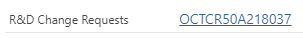
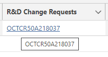
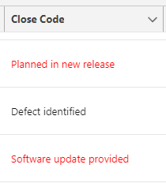
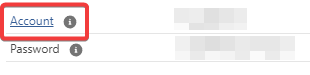
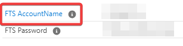
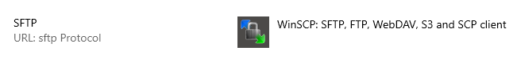
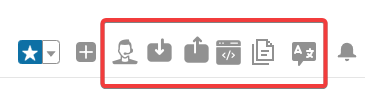
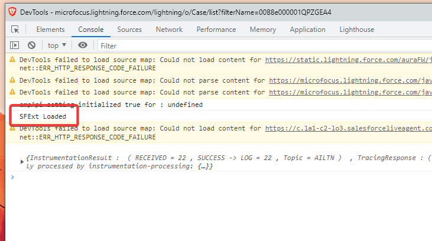

# Salesforce Extension

This is a browser extension to add useful features to Salesforce.  
It works in Chrome, Brave and Edge (Chromium) browsers.  

## Features  
- Auto refresh of queues every 60 seconds (refreshes only the queue, not the entire website).

- Create URLs to Quixy defects in cases.   
        

-  Creates URLS to Quixy defects in queues (if you have the R&D Change Requests column visible).  
     

- Highlights Fixed defects ('Planned in new release' or 'Software update provided' statuses) in Pending Release Queue.  
     

- Creates URLs to FTS via SFTP (tested with WinSCP - https://winscp.net).  
     
     
   The application used depends on the default app set in the OS for SFTP Protocol:  
     
   This can be changed in Settings -> Apps -> Default apps -> Choose default applications by protocol  

- Added QuickLink buttons for the MF Translation Request page and MF Documentation page (removing SF links that weren't useful).  
     
   If you have a case open, the product in the case will be checked and the appropriate docs page opened (only some products are supported).  
   If no cases are opened the general docs page will be opened.  

## Install
Before installing, close any instances of Salesforce you have open.  

1. Download and execute update.cmd, which downloads the extension files, in the directory where you would like the extension to be stored.  
   i.e. curl -O https://raw.githubusercontent.com/UNiXMIT/UNiXSF/main/update.cmd
2. Open Google Chrome, Brave or Edge.  
3. Navigate to chrome://extensions (or brave://extensions or edge://extensions depending on your browser) in the browser address bar.   
4. Toggle "Developer mode".  
5. Click 'Load unpacked'.  
6. Select the folder you created in step 1.  
7. The new features are now active.
8. You can now turn off "Developer mode". 
9. Once you have loaded Salesforce in your browser, you can check if the extensoion as loaded correctly by checking the browser console log (ctrl + shift + J) for the message 'SFExt Loaded'.  
  

## Update
Before updating, close any instances of Salesforce you have open.

1. Execute update.cmd, which downloads the updated extension files, overwriting the old files.
2. Open Google Chrome, Brave or Edge.  
3. Navigate to chrome://extensions (or brave://extensions or edge://extensions depending on your browser). 
4. Click the reload icon in the Salesforce Extension tile.

Alternatively you can:

1. Close all instances of your browser.
2. Execute update.cm, which downloads the updated extension files, overwriting the old files.
3. The extention will now be updated when you start your browser again.

## Limitations

1. If you have multiple case tabs open, Quixy and FTS case URLs will only work on the first open case tab.  
     

## Donate

Buy me a coffee/beer?  

- PayPal: http://bit.ly/unixmitdonate  
- Bitcoin (BTC): 15B532vsNhwHMEhmRvbs3HGLth3dieNkYq  
- Ethereum (ETH): 0xf0CCFCEe0E2a78D54A9b7aDE8A42aff5A327D970  
- Dogecoin (DOGE): DUJapbaS6gNoa5ZpHS85nSqkNL7cLJz8gb  