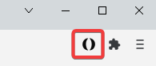
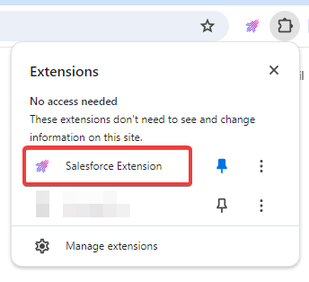
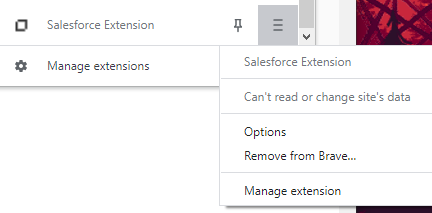
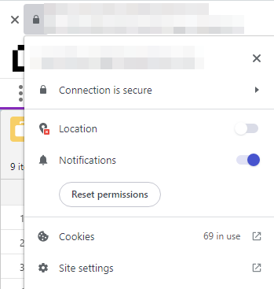
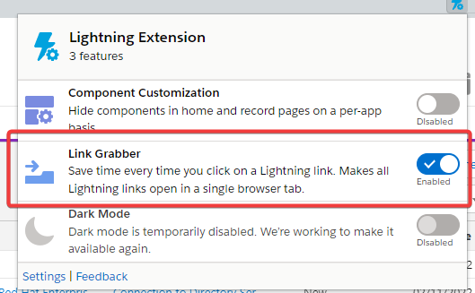

# Salesforce Extension

This is a browser extension to add useful features to Salesforce.  
It works in Chrome, Brave and Edge (Chromium) browsers.  

- [Features](#features)
- [Install](#install)
- [Update](#update)
- [Latest Release](https://github.com/UNiXMIT/UNiXSF/releases/latest)
- [Changelog](https://github.com/UNiXMIT/UNiXSF/releases)
- [Configuration](#configuration)
- [Features/Improvements Wishlist](#featuresimprovements-wishlist)
- [Troubleshooting](#troubleshooting)
- [Limitations](#limitations)
- [Optional](#optional)
- [Donate](#donate) 

## Features  
- **Auto refresh**  
  Queues refresh every 60 seconds by default (refreshes only the queue, not the entire website).  

- **Case queue monitor and notifications**  
  Notifications are generated when:  
  - A new or updated case appears in the queue, that wasn't there before.  
  - The status of a case in the queue changes to 'Pending Support (New Activity)'.  
    NOTE: The 'Case Number' and 'Status' columns need to be visible in the queue. The 'Subject' column is optional.  .       

- **QuickLink Menu**

  - FTS SFTP.   
    Uses the active case tab to get the FTS Account/Password details (tested with WinSCP - https://winscp.net).  
    If no case is open it will open the FTS homepage.  

  - Elevate to R&D.  
    Added another 'Elevate to R&D' button as the native ones have a habit of disappearing. 

  - Quixy Defects.  
    Uses the active case tab to formulate the Quixy URL to open. If no case is open it will open the Quixy homepage

  - MF Translation Request page.  
    If you have a case open and active, the case number and severity will be used to populate the corresponding fields of the translation page.   

  - MF Documentation.  
    If you have a case open and active, the product in the case will be checked and the appropriate docs page opened.  
    If no cases are opened the general docs page will be opened.  

  - Reminders/Follow-Up in Outlook Calendar.  
    Gets the case number, subject and URL from the active, open case and opens a new window to create an Outlook Calendar event with reminder set.  
    By default the calendar event start date is 3 days in the future but this can be changed, by the user, in the new window.  
  
  - Full Screen KCS Editor.  
    Make the KCS editor full screen to allow easier creation/editing of the article body.

  - 3rd Line Referral.  
    Generates an email, using a set template and information from the case.   

  - Account Team.
    Opens up the Account Team page for the case you have open.  
    Only works if you have a case open and active.  

  - Additional menu items for Support Portal, SLD Web Portal and PerformPlus.  

- **Quixy URLs**  
  Creates URLs to Quixy defects in queues (if you have the 'R&D Change Requests' column visible).  

- **Highlight Fixed Defects**  
  Highlights 'Planned in new release' or 'Software update provided' Close Codes in your Pending Release Queue.  

- **Character Counter**  
  Added character counts to 'textarea' fields.  

- **Copy to clipboard buttons for Case Number, Subject and Defect Number**  
  Added buttons next to the Case Number, Subject and Defect Number (if present) to copy that information to the clipboard.  
  The main case icon copies the Case Number and Subject at the same time.   

- **Enable the 'Set Pending Customer' checkbox as default**  
  Add option to enable the 'Set Pending Customer' checkbox as default when sending an email.  

- **Modify Case Status after Send**  
  After the 'Send' button is clicked and the email is sent from a case, a popup will appear letting you change the case status from its current status to another status.  
  If you want to keep the current status, just click 'Cancel' on the popup.  
  This can be enabled in the extension options.  

## Install

1. Download the [Latest Release SFExt.zip](https://github.com/UNiXMIT/UNiXSF/raw/main/SFExt.zip), and unzip into the directory where you would like the extension to be stored.  
2. Open Google Chrome, Brave or Edge.  
3. Navigate to chrome://extensions (or brave://extensions or edge://extensions depending on your browser) in the browser address bar.   
4. Toggle "Developer mode".  
5. Click 'Load unpacked'.  
6. Select the folder where you downloaded the files to in step 1.  
7. The new features are now active.
8. You can now turn off "Developer mode". 
9. Once you have loaded Salesforce in your browser, if the extension has loaded correctly, it should say 'SFExt' in the lower right corner.  

## Update

1. Download the [Latest Release SFExt.zip](https://github.com/UNiXMIT/UNiXSF/raw/main/SFExt.zip), and unzip into the directory where the previous version of the SF Extension is located, overwriting the old files. 
2. Open Google Chrome, Brave or Edge.  
3. Navigate to chrome://extensions (or brave://extensions or edge://extensions depending on your browser). 
4. Click the reload icon in the Salesforce Extension tile.

## Configuration

The extension can be configured via the extension options page:  

Click on the Salesforce Extension Icon and a popup will appear showing the config page.  

 

or



Alternatively:  

Click on the toolbar extension menu and select Options.  

   

### What can be configured?

- The Auto Refresh time can be configured (in seconds). _Default 60 seconds. Minimum is 30. Disabled < 30_

- The name of the case queue to monitor and URL for the webhook notifications.  
  Desktop and Web notifications can be enabled/disabled.  
  For the case queue name, either enter the name of the case queue that you want to monitor or append the name of the case queue you want to monitor with 'NOTIFY'.  

- The FTS HTTP URL.  

- The Quixy URL.  

- The translation request URL.  

- The 3rd line referral email address.  

- FTS protocol, URL and port.  

- The supported products list. This list is used to open the correct documentation page when the documentation link/icon is clicked.  

  **Requirements**  
  The list must be in JSON format.  
  The list consists of key/value pairs, separated by , and enclosed in braces { }.  
  The Key must exactly match the name of the product as it appears in cases.   
  The Value must match the sub-domain of the documentation page for that product:  
  i.e. for AcuCOBOL the URL is https://www.microfocus.com/documentation/extend-acucobol so the value must be:  
  ```
  extend-acucobol
  ```
  #### Example
   To add ChangeMan ZMF to your list of supported products, add:  
   ```
   ,"ChangeMan ZMF":"changeman-zmf"
   ```
   to the list of products. It should now look like this:  

   {"ACUCOBOL-GT (Extend)":"extend-acucobol","Enterprise Developer / Server / Test Server":"enterprise-developer","Visual COBOL":"visual-cobol","Net Express / Server Express":"net-express"**,"ChangeMan ZMF":"changeman-zmf"**}

- Custom links can be added to the QuickLink Menu. The format for the configuration is in JSON where the Key is the text of the link and the Value is the URL to load.  
  The default is {"SFExt":"https://unixmit.github.io/UNiXSF"} which sets the text to 'SFExt' and the URL of the link to 'https://unixmit.github.io/UNiXSF'  

### Save Options

Saves your options using Chrome sync. The stored data will automatically be synced to any Chrome browser that you are logged into, provided you have Chrome sync enabled.  

### Reset Options

Resets your options to default.  

### Export Options

Exports your saved options to sfext.json and allows you to download the file to your local machine.  

### Import Options

Imports your exported options from the previously exported JSON file. The imported options are then saved using Chrome sync.  

## Features/Improvements Wishlist

- I need ideas.

## Troubleshooting

- If Notifications are not working, there are a few things that could be blocking them that you need to check.  
  Windows (Desktop) notifications need to be enabled and not silenced.  
  Ensure Windows Focus Assist is set to OFF.   
  Make sure Notifications are enabled, for the Salesforce website, in your browser:  
  

- If the FTS button does not open with your local SFTP client, it may not be supported.
  The SFTP Client application used, depends on the default app set in the OS for SFTP Protocol:  
    
  This can be changed in Settings -> Apps -> Default apps -> Choose default applications by protocol.  
  To register WinSCP to handle URL addresses use the [WinSCP installer](https://winscp.net/eng/docs/ui_installer_selecttasks) or go to [Preferences dialog](https://winscp.net/eng/docs/ui_pref_integration).  

- Microsoft Edge has a query string limit of 4035 characters. If the URL generated by the 3rd Line Referral QuickLink is longer than 4035 characters it will fail with a 'HTTP 500 server error' in MS Edge. This is not a problem in Chrome/Brave.  

## Limitations  

- Where there are 2 sets of documentation for one product, it's only possible to configure the docs QuickLink to re-direct to one of those URLs.
  i.e. product 'Reflection for Secure IT' has docs in 'rsit-server-client-unix' and 'rsit-windows-client'

## Optional

This extension benefits from using it in conjunction with the [Lightning Extension](https://chrome.google.com/webstore/detail/lightning-extension/hfglcknhngdnhbkccblidlkljgflofgh)  

When 'Link Grabber' is enabled in that extension, when you click the Desktop Notifications from the Case Queue Monitor, the cases are opened in the same Salesforce tab rather than opening a new tab.  

 

## Donate

Buy me a coffee/beer?  

- PayPal: [http://bit.ly/unixmitdonate](http://bit.ly/unixmitdonate)  
- Bitcoin (BTC): 15B532vsNhwHMEhmRvbs3HGLth3dieNkYq  
- Ethereum (ETH): 0xf0CCFCEe0E2a78D54A9b7aDE8A42aff5A327D970  
- Dogecoin (DOGE): DUJapbaS6gNoa5ZpHS85nSqkNL7cLJz8gb  