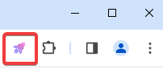

# Salesforce Extension

This is a browser extension to add useful features to Salesforce.  
It works in Chrome, Brave and Edge (Chromium) browsers.  

- [Features](#features)
- [Install](#install)
- [Update](#update)
- [Latest Release](https://github.com/UNiXMIT/UNiXSF/releases/latest)
- [Changelog](https://github.com/UNiXMIT/UNiXSF/releases)
- [Configuration](#configuration)
- [Features/Improvements Wishlist](#featuresimprovements-wishlist)
- [Issues/Limitations](#issueslimitations)
- [Optional](#optional)
- [Donate](#donate)

## Features  
- Auto refresh of queues every 60 seconds by default (refreshes only the queue, not the entire website).

- Case queue monitor and notifications when a new or updated case appears in the queue. If a case is already in a queue and then gets updated again, no notification will be generated. Only cases entering and leaving the queue are monitored, not the last modified time. The case queue set to monitor needs to be open so that the case queue monitor can find it. The extension can only act on what it open as it cannot read backend SF data. If you do not auto/manually refresh the queue then the monitor cannot check for new cases.   
   Notifications via Desktop and Webhooks are supported.  
   Case queue monitor notifications link to the case URL when clicked.  
   The name of the case to monitor can be added on the extension config page.  
   For the Case Queue Monitor to work, 'Case Number' has to be the first column in your queue, so that the cases numbers can be identified and found.  
   If the 'Subject' column is added to the queue, the case subject will also be sent in the notification.   
   Windows (Desktop) notifications need to be enabled and not silenced.  
   Ensure Windows Focus Assist is set to OFF.   
   Make sure Notifications are enabled, for the Saleforce website, in your browser:  
   

- Quixy defect QuickLink. Uses the active case tab to formulate the Quixy URL to open. If no case is open it will open the Quixy homepage.     
     

- FTS SFTP QuickLink. Uses the active case tab to get the FTS Account/Password details (tested with WinSCP - https://winscp.net). If no case is open it will open the FTS homepage.   
      
   The application used depends on the default app set in the OS for SFTP Protocol:  
     
   This can be changed in Settings -> Apps -> Default apps -> Choose default applications by protocol  

- QuickLink buttons for Support Portal, SLD Web Portal and PerformPlus.  
   ![4](data:image/png;base64,iVBORw0KGgoAAAANSUhEUgAAAB4AAAAeCAYAAAA7MK6iAAAABmJLR0QA/wD/AP+gvaeTAAADJ0lEQVRIieWVT2hcVRTGf9+diakQkFRaJZbGlkIqgouCRUUXFVeiG6EiuBEriot57yUQCm1ohyIUspi89ybZScZF/QOuSq0IXSiCduFCcBXFGjc6pi4ySWpNOzP3uHACSZPOe+lk1293ud/5fpxz73sX7jfpXoqq1eph7/0RSQfN7DHAmdlqFEXhjoNrtdqupaWl9yWFwPCWYdKhIAiu5clzeUyVSmX38vLy15Iqd4MCmNnxPHm5wc65aeCZHNaTaZq+lyczc9TT09PD7XZ7Po+3o3/N7EAURQvdTMWslFar9ZIkAT8BP5rZIUkPA3sAA66b2V/OuWtm9jbwoKRjwGc9gSXtA/Deh6Ojo9908yZJcgMYBUaycvOc8UOAFQqFq1lGM/toXU1vYDMTsBAEwa0sb6PRmAPanZrewGuZeUzlcvk28IekF6empp7oFTwi6WYecEc3gaecc5/cM7hcLjtJx7z3XUPu0NqYD/cC9sCKpAN5iDMzMwPA/s7yz27ezM8JmAQm4zi+GEXRFYA0TfvNrCRpELhULBZ/brfbj7RarUngAWDOzIJuoZm3z8yUpulVM2uFYfiCJEuS5A3g0y3sDeCtMAwvZuVmXi5JJumkpGer1eppAOfct8AV4AdJZ83sdefcy6urq/vzQGEbz2KSJB8ApyS9EwTB7Pq9OI6flvRcu92+PDY29muevDxnDIBz7jvvvczswziOh4eGhs4B1Ov1s8AEoL6+vl+AnQWb2W4ASeeB0/V6/d3O1h5J583s1JonVyN5jcAQ0CyVShPe+6OSZiXNeu+PlkqlCaDZ8eRS1zOuVCpPFgqF48ArwBHgehiGj27ljeN4QdJe4Dcz+0LS54uLi993/gWbtGHUtVpt18rKyvPe+1clvQbsu8O/eNcOpEVgL3BQUgAEg4ODfydJ8pWZXWo2m1+Oj4//s6njOI5HJZ0DBroM4RZwAbgs6XcAM3uc/yfyJtDfpfaGmZ2JomhqQ8eSChlQOsEngBNmlmHdpIEOA1h3ubz3HwPz203bhuaLxeKFtcWGy5Wmab/3fkRS304SzazZaDTmOu/1far/AN+NOS2RjAonAAAAAElFTkSuQmCC)
   
   ![6](data:image/png;base64,iVBORw0KGgoAAAANSUhEUgAAAB4AAAAeCAYAAAA7MK6iAAAABmJLR0QA/wD/AP+gvaeTAAAEI0lEQVRIie2WXYhUZRjHf885+zEsrIgtUWJUuNHFEkZeCF7kRYERRpla9kF1twTtOXPWBPvQtguzbJudc2a3VRG7qUhstS+puyIIE4QgL7JQkaz2ooI1+piZ3fP+u3BWj7MzsxbRTT1weM887/P8/+f/Pu887wv/279k1moyjuOtwAoz+x34Q1IZ+DgMw7eycUmSPCZpUZqm+wcHB7+/HOK2eeYDoEdS1rcRuIRY0giw0Pf9nXEcvz4zM7N106ZNZ1sBe/MQH27g2zYHxPPWmNkBIAUebWtrO14sFje0Am661MVi8REz2wf4GfdEEAQbzEyNckZGRq7zPK8ArAUkKcjn86OXTZwkyXpJ+zm/IkeBFcCpXC63vL+//1wrJbX8vKQCgJndFwTB2/MSDw8P97S3t38F9ABPVavVUkdHR+D7/oSkX51zA2Z2l6SltZSvgQ+cc2NRFE3O4hSLxcjMCsAvZtYXBMF3WZ45NW5vbx+ukR4Ow/DFzZs3/xaG4Y40TW9xzp0AtkjqA3K1ZxnwjOd5J+I43jiLk8/nR4BDwAJgez3PJcSjo6PXAg8DFedckPn6DcCbQHc9QMYWAG9kyYE8MC3pwVKptLgpcZqm9wO+mX0YRdFpgEKhsMjMxqkri3NupaRVDYTsGRsbuwogDMNvzewg0Jam6QNNiYHbAGobCwDf9wPginp5URQdyefznzZQ3j0zM/NE5ve7AJ7n3dqKuA/AzL7M+O5oAD6frQGI4/gVSbsAJN2eJMlHxWJxHcztXD21MbsDb5p9cc6tjKLoSDYhDEOrkawEPqu5Z3f8Ms7XHqBL0mozqwIT9YoF0N3dXc340tkX3/c7mkl0zmXnXG3cWx8maTvUKTazHyVdMzU1tRg4XXOfAm4GkPRJHMf1Sud0MTM7CZDL5SbK5fIkcHVtalc+nz8KdTWWdLymrC/jfr+ZymYm6X2A/v7+aWBPzT2Zy+Weno25RLFz7mXf93+qVqsX6mhmJUkhF2sFQJIkq9I0bdRyz01PT1/oz2Y2Blyfpulr2Xbb8jzOkNwr6QDzn2bOObcuiqJ35sOcDwiAIAgOAuuBVgfE1OWStiQeGhryxsfHr5RkAGEYHvJ9fykwJOkYMAVMSTpmZs/5vt+bJR0ZGVk4m9vImk7EcbwD2AJUgDNmdkbSF7lcbltt0zQ0SVYqlZ6U9ALwUhiGz/4lxcDPtbETuFHSamBLpVK5oVlCoVDoTZLkkKSdgCfpm2axTRXv3r27q1wun+TifxDOL+2Ac+7zNE0nu7q6zDm3RNJy4G5J9wDtwDkzeygIgkZXp9bEAEmSPC7p1VYxdTYD7PM87/mBgYEfWgW2vGV2dnburVQqg5J6gU2SymZ2J9ALLKmFnQVOSzrsed579TeNv21JkiyN43jtPwL2n7Y/AV3byB9Mdkm4AAAAAElFTkSuQmCC)

- QuickLink button for the MF Translation Request page. 
   If you have a case open and active, the case number will be used to populate the Case Number field of the translation page.  
     

- QuickLink button for the MF Documentation.
   If you have a case open and active, the product in the case will be checked and the appropriate docs page opened.  
   If no cases are opened the general docs page will be opened.  
   

-  Creates URLs to Quixy defects in queues (if you have the R&D Change Requests column visible).  
     

- Highlights Fixed defects ('Planned in new release' or 'Software update provided' statuses) in Pending Release Queue.  
     

## Install

1. Download the [Latest Release UNiXSF.zip](https://github.com/UNiXMIT/UNiXSF/releases/latest), and unzip into the directory where you would like the extension to be stored.  
2. Open Google Chrome, Brave or Edge.  
3. Navigate to chrome://extensions (or brave://extensions or edge://extensions depending on your browser) in the browser address bar.   
4. Toggle "Developer mode".  
5. Click 'Load unpacked'.  
6. Select the folder you created in step 1.  
7. The new features are now active.
8. You can now turn off "Developer mode". 
9. Once you have loaded Salesforce in your browser, if the extension has loaded correctly it should say 'SFExt' in the lower right corner.  

## Update

1. Download the [Latest Release UNiXSF.zip](https://github.com/UNiXMIT/UNiXSF/releases/latest), and unzip into the directory where the previous version of the SF Extension is located, overwriting the old files. 
2. Open Google Chrome, Brave or Edge.  
3. Navigate to chrome://extensions (or brave://extensions or edge://extensions depending on your browser). 
4. Click the reload icon in the Salesforce Extension tile.

## Configuration

The extension can be configured via the extension options page:  

Click on the Salesforce Extension Icon and a popup will appear showing the config page.  

 

or


Alternatively:  

Click on the toolbar extension menu and select Options.  

   

### What can be configured?

- The Auto Refresh time can be configured (in seconds). _Default 60 seconds. Minimum is 30. Disabled < 30_

- The name of the case queue to monitor and URL for the webhook notifications.  
   Desktop and Web notifications can be enabled/disabled.  
   For the case queue name, either enter the name of the case queue that you want to monitor or append the name of the case queue you want to monitor with 'NOTIFY':  
    

- The supported products list. This list is used to open the correct documentation page when the documentation link/icon is clicked.  

  **Requirements**  
  The list must be in JSON format.  
  The list consists of key/value pairs, separated by , and enclosed in braces { }.  
  The Key must exactly match the name of the product as it appears in cases:   
    
  The Value must match the sub-domain of the documentation page for that product:  
  i.e. for AcuCOBOL the URL is https://www.microfocus.com/documentation/extend-acucobol so the value must be:  
  ```
  extend-acucobol
  ```
  #### Example
   To add ChangeMan ZMF to your list of supported products, add:  
   ```
   ,"ChangeMan ZMF":"changeman-zmf"
   ```
   to the list of products. It should now look like this:  

   {"ACUCOBOL-GT (Extend)":"extend-acucobol","Enterprise Developer / Server / Test Server":"enterprise-developer","Visual COBOL":"visual-cobol","Net Express / Server Express":"net-express"**,"ChangeMan ZMF":"changeman-zmf"**}

- Custom links can be added to the footer of Salesforce. The format for the configuration is in JSON where the Key is the text of the link and the Value is the URL to load.  
  The default is {"SFExt":"https://unixmit.github.io/UNiXSF"} which sets the text to 'SFExt' and the URL of the link to 'https://unixmit.github.io/UNiXSF'  

### Save Options

Saves your options using Chrome sync. The stored data will automatically be synced to any Chrome browser that you are logged into, provided you have Chrome sync enabled.  

### Reset Options

Resets your options to default.  

### Export Options

Exports your saved options to sfext.json and allows you to download the file to your local machine.  

### Import Options

Imports your exported options from the file sfext.json located in the config directory of this extension. The imported options are then saved using Chrome sync.  

## Features/Improvements Wishlist

- Highlight keywords in Closure Summary.

## Issues/Limitations

- Where there are 2 sets of documentation for one product, it's only possible to configure the docs QuickLink to re-direct to one of those URLs.
  i.e. product 'Reflection for Secure IT' has docs in 'rsit-server-client-unix' and 'rsit-windows-client'

## Optional

This extension benefits from using it in conjunction with the [Lightning Extension](https://chrome.google.com/webstore/detail/lightning-extension/hfglcknhngdnhbkccblidlkljgflofgh)  

When 'Link Grabber' is enabled in that extension, when you click the Desktop Notifications from the Case Queue Monitor, the cases are opened in the same Salesforce tab rather than opening a new tab.  

 

## Donate

Buy me a coffee/beer?  

- PayPal: [http://bit.ly/unixmitdonate](http://bit.ly/unixmitdonate)  
- Bitcoin (BTC): 15B532vsNhwHMEhmRvbs3HGLth3dieNkYq  
- Ethereum (ETH): 0xf0CCFCEe0E2a78D54A9b7aDE8A42aff5A327D970  
- Dogecoin (DOGE): DUJapbaS6gNoa5ZpHS85nSqkNL7cLJz8gb  